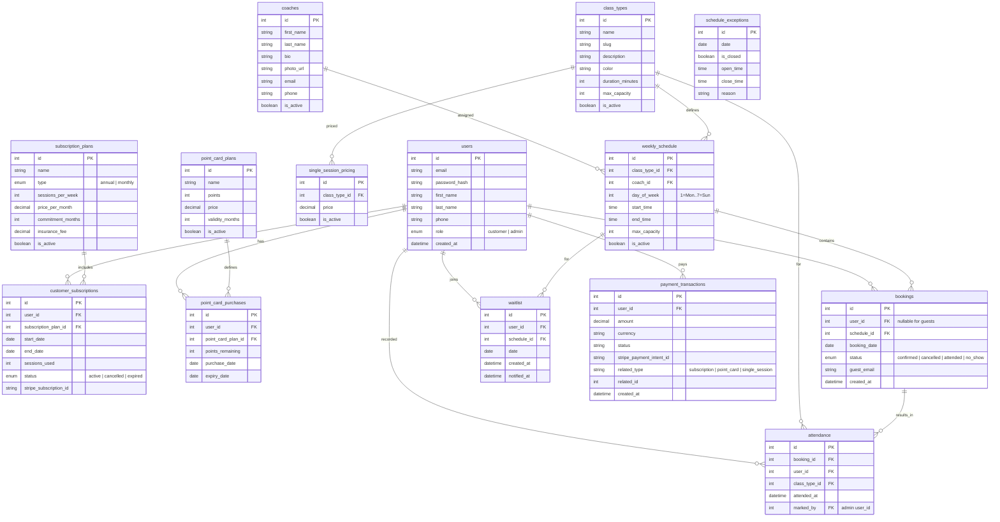

# Product Requirements Document

## Overview

A full-featured appointment and event booking SaaS platform built with React + Tailwind CSS, designed for fitness studios, sports centers, and wellness businesses.

## Target Audience (Primary)

- Fitness & sports studios (yoga, pilates, CrossFit, martial arts, etc.)
- Wellness centers, spas, and pools
- Independent coaches and instructors offering group or private sessions

## Features

### Booking & Schedule

- **Schedule Management** — Define a recurring weekly timetable with time slots per day. Handle exception dates (holidays, closures) via `schedule_exceptions`. Each schedule entry links to a class type and instructor, with configurable max capacity.
- **Class / Service Management** — CRUD for class/service types: name, description, intensity level, duration, max capacity, color coding. Used as the building block for all schedule entries.
- **Booking Wizard** — Customer selects a class from the schedule, picks a date, and confirms their spot. Supports both authenticated users and guest flow (first session free).
- **Booking Deduction Logic** — On booking, deduct from subscription sessions first, then point card points, then redirect to purchase if no credit. On cancellation, points are refunded; subscription bookings incur no penalty.
- **Class Capacity & Waitlist** — Hard capacity limit per schedule entry. Once full, customers join a FIFO waitlist. On cancellation, the first waitlisted person is auto-promoted with a time-limited confirmation window. Auto-remove after the class date passes or on opt-out.

### Customer Experience

- **Public Site Pages** — Home (hero, reviews, schedule preview, class cards, gallery, contact), Classes (detailed descriptions & images), Pricing (subscriptions, point cards, single session — live from DB), About (instructor/company bio, team), Contact (info + form), Customer Portal (login gateway).
- **Calendar View** — Weekly/monthly calendar showing scheduled classes, booked spots, and remaining capacity at a glance.
- **Customer Panel** — Authenticated dashboard to view upcoming bookings, cancel/reschedule, check subscription status and session usage, view payment history.

### Admin & Management

- **Admin Dashboard** — KPIs: active subscriptions, class occupancy rates, revenue, new signups. Charts and attendance overview.
- **Instructor Management** — Instructor profiles, bio, photo, class assignments. Built for multi-instructor scaling.
- **Attendance & Session Tracking** — Check-in per session. Track per-participant session usage within their subscription period. Overview per week/month/custom date range showing used and remaining sessions.
- **Reporting & Export** — All list views and reports exportable to XLS and PDF (customers, attendance, subscriptions, revenue, occupancy).

### Billing & Payments

- **Subscription & Pricing** — Monthly and annual plans with configurable sessions-per-week, commitment months, insurance fees. Point card plans (fixed points, validity period). Single session pricing per class type. First-session-free promo with one-per-person enforcement. Discounts and auto-renewals.
- **Payment Integration** — Stripe (primary) + PayPal (secondary). Supports subscription recurring payments, one-time payments (point cards, single sessions), and free trial. Webhook handling for payment events (succeeded, failed, refunded). Automatic invoice generation, refund processing from admin panel, failed payment retry + admin notification.

### Platform

- **Authentication & Roles** — JWT-based with two roles: Customer (bookings, subscription status, session usage, payment history) and Admin (full dashboard access). Guest flow: first session free without account — post-booking link to set password and activate panel. Admin created via seed script (no public registration). Email + password only.
- **Email Notifications** — Email channel with transactional templates: booking confirmation, 24h reminder, cancellation confirmation, waitlist spot opened, subscription confirmation, payment receipt, payment failed (customer + admin), renewal reminder (7 days), contact form (admin), account activation (guest).
- **Multi-language** — i18n approach (react-i18next or similar). All user-facing strings externalized. Primary language set per deployment via configuration.
- **SEO & Metadata** — Per-page meta titles, descriptions, Open Graph tags. JSON-LD structured data for LocalBusiness. Sitemap.xml, robots.txt, canonical URLs.
- **Analytics** — Umami (self-hosted, privacy-friendly). Tracks page views, booking confirmed, waitlist joined, subscription purchased, contact form submitted. Embedded dashboard at `/admin/analytics`.
- **GDPR & Legal** — Cookie consent banner (explicit opt-in for non-essential cookies). Privacy policy page. Terms of Use and Sale page. Account deletion flow. Data retention with auto-deletion. Unsubscribe link in all emails.

## Tech Stack

- **Frontend:** React + TypeScript
- **Styling:** Tailwind CSS
- **Build Tool:** Vite
- **Routing:** React Router
- **State Management:** TanStack Query (server/API data) + Zustand (client/UI state)
- **Database:** PostgreSQL
- **Backend:** REST API (Laravel + PHP 8)

## Design System

**Colors (default palette — can be customized per tenant):**

- Primary: sky-500 `#0EA5E9`, sky-700 `#0369A1`
- Accent: rose-500 `#F43F5E`
- Warm accent: amber-500 `#F59E0B`
- Secondary: teal-500 `#14B8A6`
- Background: sky-50 `#F0F9FF`
- Text: slate-900 `#0F172A`, slate-600 `#475569`

**Typography:** Plus Jakarta Sans (headings) + system-ui (body)

**Shapes:** Rounded-2xl cards, rounded-full buttons, rounded-xl inputs

**Shadows:** shadow-md default, shadow-lg on hover

**Vibe:** Clean boutique fitness — energetic, premium but approachable

## Database Schema

### Core Entities

## Design Principles

- **SOLID** — Single responsibility, Open-closed, Liskov substitution, Interface segregation, Dependency inversion
- **DRY** — Don't repeat yourself. Extract shared logic into hooks, utils, or components
- **User-friendly first** — Intuitive flows for both customers (booking in < 30s) and admins (dashboard clarity). Minimal clicks to accomplish common tasks.
- **Mobile-first** — Both customer booking and admin dashboard fully responsive.
- **Accessible** — WCAG AA compliance target.
- **Performance** — Fast loads, optimistic UI updates, graceful error handling.

## Infrastructure & DevOps

| Area           | Detail                                                            |
| -------------- | ----------------------------------------------------------------- |
| **Hosting**    | TBD (VPS / shared hosting based on backend choice)                |
| **Domain**     | Configured per deployment                                         |
| **SSL**        | Let's Encrypt via Certbot or hosting auto-SSL                     |
| **CI/CD**      | GitHub Actions — lint, typecheck, test on PR; auto-deploy on main |
| **Backups**    | Daily PostgreSQL dump, retained 30 days                           |
| **Monitoring** | Uptime monitoring (UptimeRobot or similar)                        |

## Seed Data

A database seed script provisions demo data for development and staging environments. All seeding is idempotent (skips existing records).

| Entity                     | Source / Approach                            | Notes                                                                  |
| -------------------------- | -------------------------------------------- | ---------------------------------------------------------------------- |
| **Users**                  | `https://jsonplaceholder.typicode.com/users` | Fetch via HTTP, map to `users` table. First entry promoted to `admin`. |
| **Coaches**                | 3–5 hardcoded instructor profiles            | Name, bio, photo_url, email, phone, `is_active = true`                 |
| **Class Types**            | 5–8 hardcoded service types                  | Name, slug, description, color, duration, max_capacity                 |
| **Weekly Schedule**        | Generated from class types + coaches         | Spread across days/times, configurable capacity                        |
| **Schedule Exceptions**    | 2–3 hardcoded holiday/closure dates          | Past and future dates for testing                                      |
| **Subscription Plans**     | 4–6 hardcoded plans (monthly + annual)       | Mix of session counts, commitment months, insurance fees               |
| **Point Card Plans**       | 3 hardcoded point card options               | 5/10/20 points, varying prices and validity periods                    |
| **Single Session Pricing** | 1 price per class type                       | Default price for each active class type                               |
| **Sample Bookings**        | 10–15 generated from users + schedule        | Mix of confirmed, cancelled, attended, no-show statuses                |
| **Sample Attendance**      | Subset of attended bookings                  | Marked_by set to admin user                                            |

## Testing Methodology

### Unit Testing

- **Framework:** Vitest
- **Scope:** All utils, hooks, stores (Zustand), components with isolated logic
- **Target:** >= 80% coverage on utilities and stores

### Component Testing

- **Framework:** Testing Library + Vitest
- **Scope:** All reusable components (buttons, cards, forms, modals, calendar), page-level integration tests for critical flows
- **Key flows to test:** Booking wizard (all steps), login/register, subscription purchase, attendance check-in

### E2E Testing

- **Framework:** Playwright
- **Scope:**
  - Public site: full navigation, contact form submission, class browsing
  - Booking flow: guest booking (first free session), authenticated booking, cancellation
  - Admin: login, CRUD schedule/classes/subscriptions, attendance marking, report export
  - Customer panel: login, view bookings, cancel booking, session usage view
- **Target:** All critical paths covered before launch

### API Testing

- **Framework:** Supertest (Node) or PHPUnit (PHP) depending on backend
- **Scope:** All endpoints — auth, CRUD operations, booking logic, capacity edge cases, waitlist trigger
- **Validation:** Input validation errors, auth guards (customer vs admin), idempotency

### Performance Testing

- Dashboard load times (< 2s initial load)
- Booking wizard responsiveness under concurrent bookings
- Export generation time (< 5s for standard reports)
